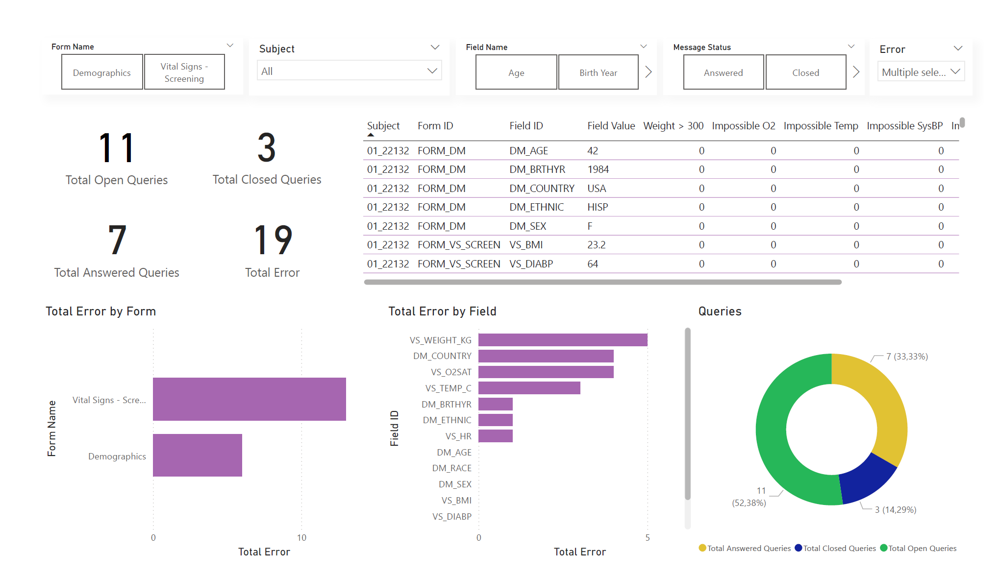

# 🧬 Clinical Data Quality & EDC Query Management Dashboard

---

## 🧭 Project Overview

This project simulates a **Clinical Data Management (CDM) workflow** based on Electronic Data Capture (EDC) systems used in clinical trials.

It demonstrates how clinical data is **reviewed, validated, and cleaned through a structured query lifecycle**, and how subject-level data is explored for quality and consistency checks.

The workflow reflects real-world processes in:
- Clinical Research Organizations (CROs)
- Pharmaceutical clinical trials
- Real-World Data (RWD) environments

---

## 🎯 Objectives

- Identify clinical data quality issues (missing values, inconsistencies, implausible measurements)
- Simulate an EDC query lifecycle (Open → Answered → Closed)
- Detect cross-field inconsistencies (e.g., BMI validation logic)
- Enable subject-level clinical review and exploration
- Build structured dashboards for clinical data monitoring in Power BI

---

## 📊 Dashboard Storytelling

This project follows a progressive analytical workflow:

> Global Overview → Data Quality Detection → Subject-Level Investigation

---

## 1️⃣ EDC Data Overview – “Understanding the dataset”

This dashboard provides a **high-level structural view of the dataset**, focusing on:

- Dataset completeness
- Distribution of clinical fields
- Overall data structure validation

👉 Purpose: establish baseline understanding before deeper analysis.

---

## 2️⃣ Discrepancies Dashboard – “Detecting data quality issues”

This section focuses on **clinical data quality monitoring and anomaly detection**, including:

- Missing data patterns
- Implausible clinical values
- Cross-variable inconsistencies (e.g., BMI validation)
- Query lifecycle tracking (Open / Answered / Closed)

👉 Purpose: identify and manage data integrity issues in clinical workflows.

---

## 3️⃣ Subject Drilldown – “Patient-level clinical inspection”

This dashboard enables **granular subject-level exploration**, including:

- Individual patient profiles
- Vital signs and demographic review
- Subject-specific discrepancies
- Cross-subject comparison

👉 Purpose: support clinical validation at patient level.

---

## 🧠 Key Analytical Concepts

This project demonstrates applied understanding of:

- Clinical data validation frameworks
- EDC query lifecycle management
- Rule-based data quality checks
- Subject-level clinical analytics
- Exploratory data analysis in healthcare datasets

---

## ⚠️ Data Quality Considerations

The analysis simulates real-world clinical data issues such as:

- Missing demographic and clinical fields
- Physiological outliers and implausible values
- Logical inconsistencies between variables (e.g. BMI vs height/weight)
- Duplicate or redundant records
- Workflow delays in query resolution

---

## 🛠 Tools & Technologies

- Python (pandas, data preprocessing & analysis)
- Jupyter Notebook
- Matplotlib / Seaborn
- Power BI (dashboard design layer)
- Excel (data inspection and validation)

---

## 🧭 Professional Relevance

This project is relevant for roles in:

- Clinical Data Management (CDM)
- Clinical Data Analyst / Clinical Data Scientist
- Real-World Data (RWD) Analytics
- Pharmaceutical and CRO environments
- Healthcare data quality roles

---

## 💡 Key Takeaway

This project demonstrates how clinical data can be structured, validated, and analyzed through a **real-world EDC-style workflow**, bridging raw healthcare data with actionable quality insights using dashboarding and analytical reasoning.

---

## 📬 Contact

📧 Email: mailto:israelddh@hotmail.com  
🔗 LinkedIn: https://www.linkedin.com/in/israel-duarte/  
🆔 ORCID: https://orcid.org/0000-0001-5427-6019  
